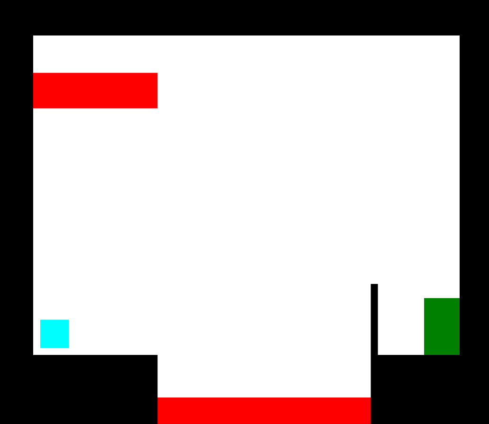
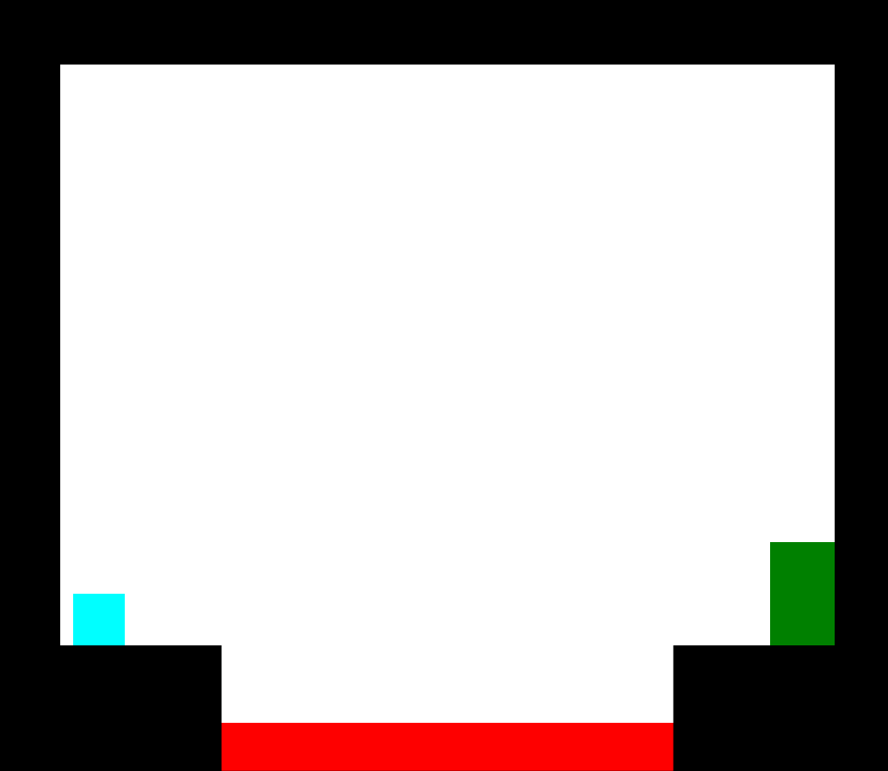

# PortalGame
A 2D game where the player solves puzzles using wormhole-like portals.

---

A level-based game where the player solves puzzles, trying to get to an objective in the level(like a door). The player is given a Portal-making tool to help them solve the puzzles and get to the end of the level. The player is able to enter through one portal and exit the other. 

# Controls
| Input         | Effect                |
|---------------|-----------------------|
|   Left-Click  | Fire an orange portal |
|   Right-Click | Fire a blue portal    |
|   W           | Jump                  |
|   A           | Move left             |
|   D           | Move right            |
|   P           | Return to main menu   |
|   Spacebar    | Restart level         |