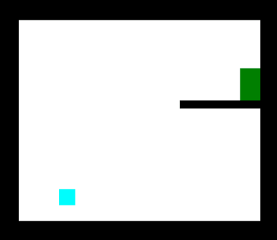
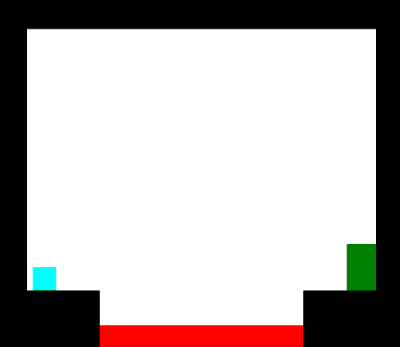

# portals :large_blue_circle::orange_circle:
A 2D game where the player solves puzzles using wormhole-like portals.

---
 

A level-based game where the player solves puzzles to get to the level's green door. The player uses portals which grant them wormhole-like travel to avoid obstacles and maneuver their way to the objective. When the player enters through one portal, they exit out of the other.

# Controls
| Input         | Effect                |
|---------------|-----------------------|
|   Left-Click  | Fire an orange portal |
|   Right-Click | Fire a blue portal    |
|   W           | Jump                  |
|   A           | Move left             |
|   D           | Move right            |
|   P           | Return to main menu   |
|   Spacebar    | Restart level         |
